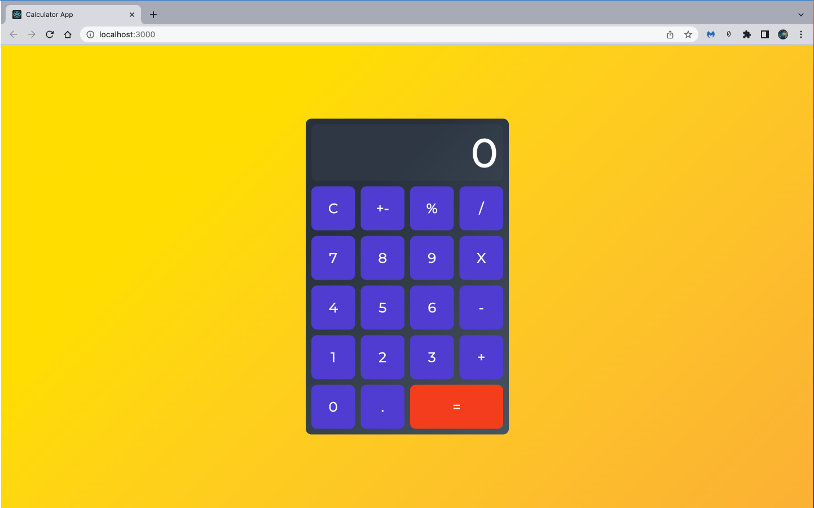
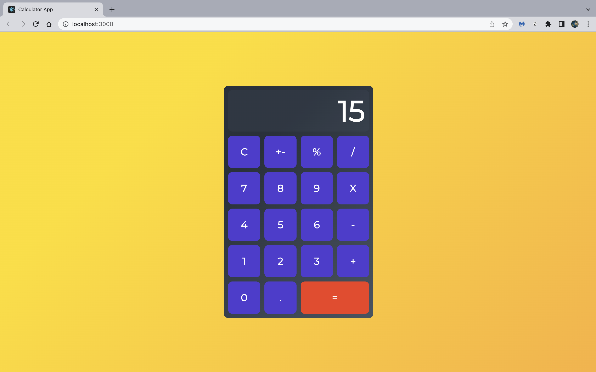

# Web-Bassed Calculator App

This application was written using React. You can learn more about React [here](https://reactjs.org/docs/getting-started.html).

This project was implemented with the goal of learning a web application framework. There are several webframe work out there among which are: django that uses python, NodeJs, and React which uses the power of JavaScript.

This web based calculator is interractive and it solves basic mathematical calculations.

### YouTube Video
I have recorded a youtube video demonstrating the project and showing some part of the code logic in creating this application. You can find the video by click this [link](sfsdfs)

### Tech Stack
This project was created solely using React. React offers command line tools that help you get up to speed in the creation of your web application.

### References and Credits
- [SitePoint](https://www.sitepoint.com/react-tutorial-build-calculator-app/?utm_medium=email&utm_campaign=spw-37&utm_source=sitepoint-weekly)
- [React](https://reactjs.org/docs/getting-started.html)

### Picture Time
Calculator Home Page

Input Entered
